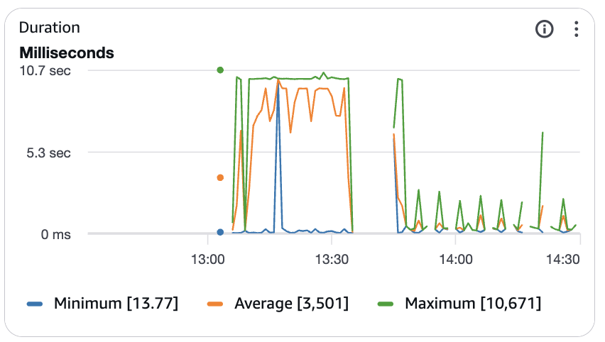
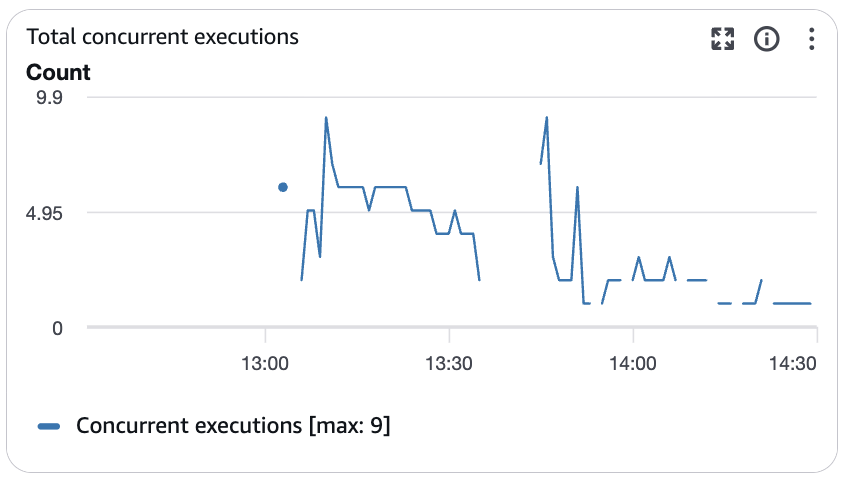
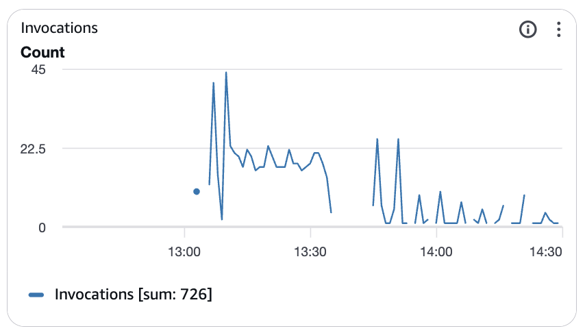

# Chapter 1: The Missing 's'

## Or, How I Reduced My Cloud Bill by 99% Because I Forgot a Letter

---

There's a particular kind of madness that comes with optimization. You make a change. You measure. The numbers move, but not enough. You make another change. You measure again. The numbers barely budge. You start to wonder if the universe is conspiring against you.

But you keep going. Because that's what engineers do.

---

### The Setup

I was building something absurd: Kubernetes on AWS Lambda. The control plane—the brain of any Kubernetes cluster—running on serverless infrastructure. Pay only for what you use. No idle EC2 instances burning money while you sleep.

The architecture worked. Pods scheduled. Nodes registered. kubectl responded. But the bill didn't make sense.

$197 a month. For a single-node cluster running one pod.

That's more than running a dedicated EC2 instance 24/7. The whole point of serverless was to pay less when you're not using it. Something was deeply wrong.

---

### The Grind

So began the optimization campaign. Not a sprint—a marathon. Weeks of incremental changes, each one shaving off a few percentage points.

**Week 1**: Set `REQUEST_MAX_TIMEOUT=15` on the API server. Cap watch connections at 15 seconds instead of letting them run indefinitely. Result: costs went *up* to $249/month. More invocations, shorter but more frequent.

**Week 2**: Disabled `WatchListClient` feature gate. Stopped the streaming LIST+WATCH pattern. Result: $186/month. Progress, but not enough.

**Week 3**: Commented out CSI plugin. Disabled RuntimeClass manager. Two fewer informers making API calls. Result: $117/month. Getting better.

**Week 4**: Added `SyncFrequency` patch. Made Pod/Node/Service reflectors resync on a schedule instead of relying purely on watches. Result: $112/month.

Four weeks of work. Still paying more than a t3.large EC2 instance.

---

### The Pattern

Every change followed the same ritual:
1. Modify a patch file
2. Push to GitHub
3. Wait for CI to build
4. Pull the new image
5. Start the node
6. Create a test pod
7. Wait 30-60 minutes
8. Query CloudWatch metrics
9. Calculate monthly projection
10. Update the cost tracking document
11. Repeat

The numbers would improve by 10%, maybe 20%. Enough to justify the effort, not enough to declare victory.

I started tracking everything in a markdown file. Every configuration change. Every measurement. A forensic record of incremental progress.

| Date | Change | Cost |
|------|--------|------|
| Jan 26 | Baseline | $197 |
| Jan 29 | REQUEST_MAX_TIMEOUT=15 | $249 |
| Feb 7 | WatchListClient=false | $186 |
| Feb 10 AM | CSI/RuntimeClass disabled | $117 |
| Feb 10 PM | SyncFrequency patch | $112 |

The trend was good. But $112/month for a serverless Kubernetes control plane still felt wrong. The whole system should be nearly idle. Why so many Lambda invocations?

---

### The Investigation

I pulled CloudWatch logs. Traced every API request. Built a traffic analysis.

The kubelet was making requests every 11 seconds. Not every 5 minutes like my configuration specified. Something was ignoring my carefully tuned backoff settings.

```
08:19:07: 1 invocation
08:19:18: 1 invocation  (+11s)
08:19:29: 1 invocation  (+11s)
08:19:41: 1 invocation  (+12s)
08:19:52: 1 invocation  (+11s)
```

Eleven seconds. That's suspiciously close to the server's 15-second watch timeout. The watches were ending, and the client was immediately reconnecting. No backoff at all.

I checked the configuration. The environment variables were set:

```
WATCH_BACKOFF_INIT="300"
WATCH_BACKOFF_MAX="300"
WATCH_BACKOFF_ON_EMPTY="true"
```

Five minutes of backoff. Clearly specified. Completely ignored.

---

### The Bug

Then I found it.

Go's `time.ParseDuration()` function. The thing that turns a string like `"5m"` into a time value. It's strict about format. Very strict.

```go
time.ParseDuration("300")   // ERROR: missing unit
time.ParseDuration("300s")  // OK: 300 seconds
time.ParseDuration("5m")    // OK: 5 minutes
```

My configuration:
```sh
WATCH_BACKOFF_INIT="300"   # WRONG
```

What it needed:
```sh
WATCH_BACKOFF_INIT="5m"    # RIGHT
```

One letter. The letter 's'. Or 'm'. Any unit suffix at all.

The Go code silently fell back to defaults when parsing failed. No error message. No warning. Just... defaults. The defaults that meant "reconnect immediately after every watch."

---

### The Fix

```diff
- WATCH_BACKOFF_INIT="300"
+ WATCH_BACKOFF_INIT="5m"
```

Push. Build. Deploy. Measure.

```
Invocations/hour: 162 (was 1,138)
Average duration: 450ms (was 8,232ms)
Monthly cost: ~$1 (was $112)
```

Ninety-nine percent reduction. Because of an 's'.

---

### The Evidence

| Duration | Concurrency | Invocations |
|:--------:|:-----------:|:-----------:|
|  |  |  |
| *Average dropped from 10.7s to ~0ms* | *Max concurrent dropped from 9 to ~1* | *Invocations dropped from 45/min to near 0* |

The graphs tell the story. Around 13:45 UTC, the fix deployed. Before: a wall of activity. After: silence. The system finally doing what it was supposed to do—nothing, until needed.

---

### The Lesson

There's a story engineers love to tell about a consultant who charges $10,000 to fix a machine. He walks in, looks around, and draws an X on a pipe with a marker. "Replace this part," he says. The manager is furious. "Ten thousand dollars for drawing an X?" The consultant smiles. "Drawing the X was $1. Knowing where to draw it was $9,999."

The corollary nobody mentions: sometimes knowing where to draw the X takes weeks of drawing X's in the wrong places.

I could have found this bug on day one. I could have noticed that `time.ParseDuration("300")` returns an error. I could have added logging to the init() function. I could have checked if the environment variables were actually being applied.

But I didn't know to look there. I didn't know that a missing unit suffix would silently fail. I didn't know that the defaults would cause exactly this behavior.

I only found it because I kept measuring. Kept tweaking. Kept asking "why isn't this working?"

---

### The Payoff

$112/month to $1/month.

More importantly: the satisfaction of understanding the system completely. Of knowing exactly how every configuration option affects behavior. Of having a forensic record of every experiment.

The dashboard now shows numbers that make sense. Lambda invocations spike briefly when a node boots, then settle to a gentle heartbeat every 5 minutes. Costs stay within free tier.

This is what serverless Kubernetes should look like.

---

### The Takeaway

Keep beating the drum.

When optimization doesn't work, check your assumptions. When configuration is ignored, check the parsing. When behavior doesn't match settings, add more logging.

And always, always include the units.

```go
time.ParseDuration("5m")  // Not "300"
```

Sometimes the difference between $112/month and $1/month is a single letter.

---

*February 11, 2026*
*Total time to find the bug: 4 weeks*
*Total time to fix the bug: 30 seconds*
*Character count of the fix: 1*
